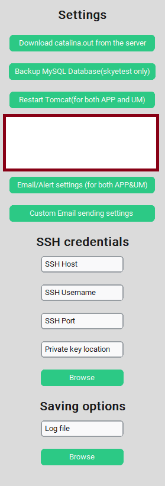
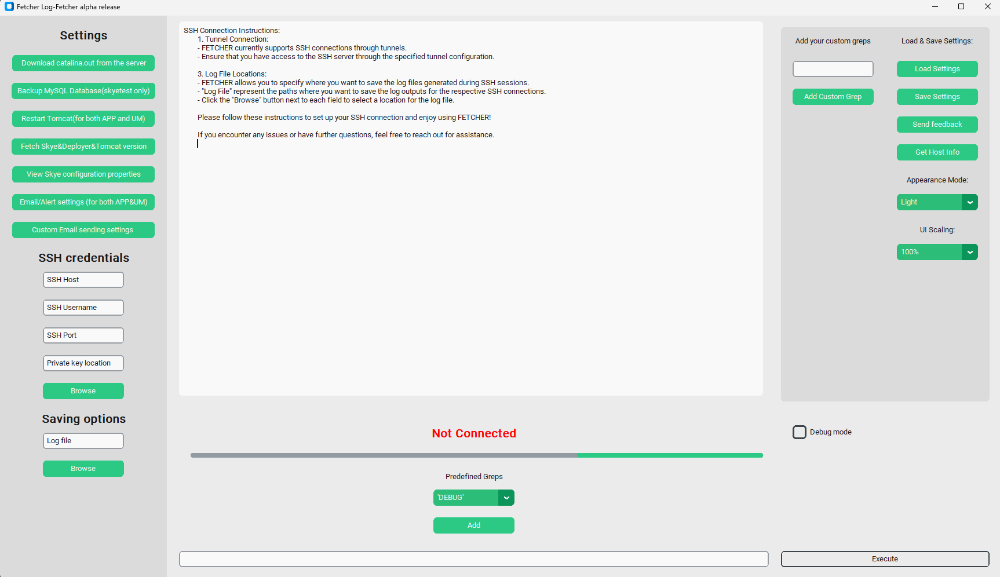
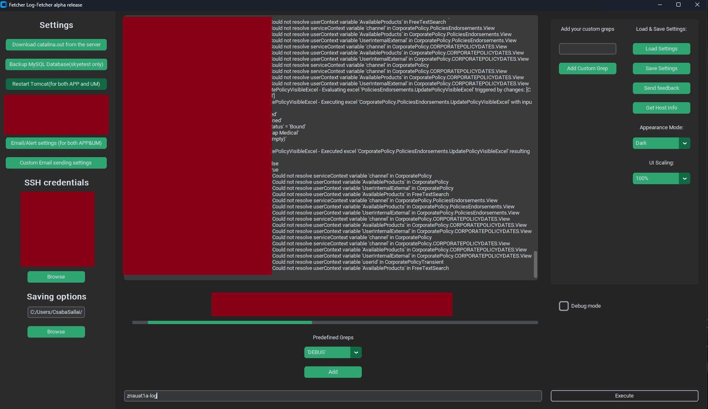
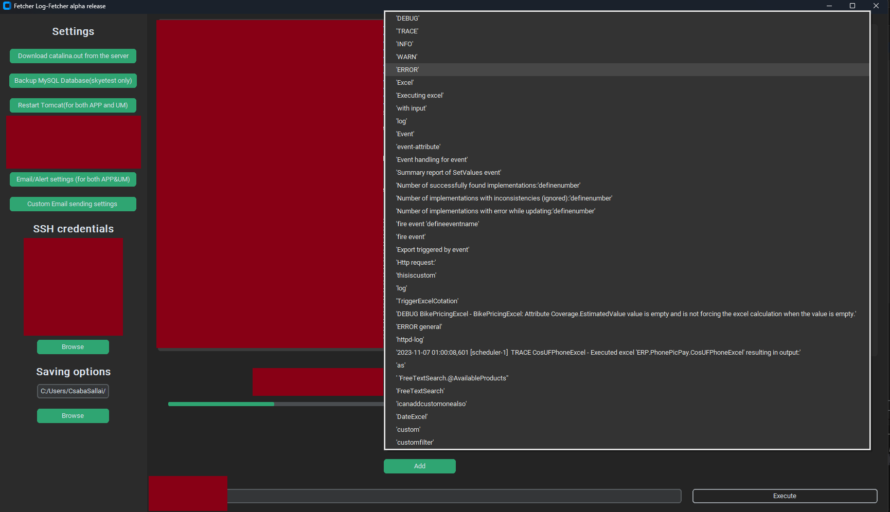

# **Real-time log retrieval tool**
## Install scripts are available


## **Table of Contents**
0. [Install scripts](#install-scripts)
1. [Connection methods, how to use the app](#connection-methods-how-to-use-the-app)
2. [Introduction](#introduction)
3. [Features](#features)
4. [Screenshots](#screenshots)
   - [Main Window](#main-window)
   - [Fetching Logs Based on the Grep You Use](#fetching-logs-based-on-the-grep-you-use)
   - [Adding / Creating Greps](#adding--creating-greps)
   - [Download catalina.out from server](#download-catalinaout-from-server)
   - [Email scehduler](#email-scheduler)
5. [Installation](#installation)
   - [Prerequisites](#prerequisites)

---

## Install scripts

<b>For windows users:</b>
1. Download and install Python 3.11, either from Windows store, or from website
<br>[Windows store version](https://apps.microsoft.com/detail/9nrwmjp3717k?hl=hu-hu&gl=US)
<br>[Official website](https://www.python.org/ftp/python/3.11.0/python-3.11.0-amd64.exe)
2. Run the following

    ```
    .\install.ps1 -install
    ```

    ```
    Usage:
    .\install.ps1 -install    Install the dependencies from requirements.txt
    .\install.ps1 -run        Run the application
    .\install.ps1 -clean      Clean the virtual environment and cache files
    .\install.ps1 -help       Display this help message
    ```
3. To run the Applicaiton
    ```
    .\install.ps1 -run
    ```
    
<b>For Linux/MacOs:</b>
1. Run the following

    ```
    make install
    ```

    ```
    "Usage:"
    "  make            - Default target, install dependencies and run the app"
    "  make install    - Install the dependencies from requirements.txt"
    "  make run        - Run the application"
    "  make clean      - Clean the virtual environment and cache files"
    "  make help       - Display this help message"
    ```
2. To run the application
    ```
    make run
    ```
## Connection methods, how to use the app

To connect to any stages, there are two methods:
<br>a. For stages that use a bastion host (jumphost), you need to tunnel and open port 22.
<br>b. For stages that do not have a jumphost or bastion host, you can connect directly.

## **Introduction**
The **Real-time log retrieval tool** is created to 
* Retrieve and filter logs from remote servers via SSH connections in real-time.

* This tool connects to one or more remote servers, executes custom commands, and continuously saves the logs to your local machine. It's ideal for monitoring and analyzing logs without the hassle of manual downloads, or using Putty/Terminals.

## **Features**
- **Real-time log retrieval/saving** from remote servers.
- **Customizable SSH connection** parameters and remote commands.
- **Concurrent SSH connections** using threads for efficiency.
- **Log filtering options** for specific events or patterns, using greps.
- **Download catalina.out from the server**
- **Backup MySQL Database**
- **Restart Tomcat**
- **Fetch / Deployer / Tomcat version**
- **View configuration properties**
- **Email sending possibility, scheduler (beta)**


## Screenshots:

## Available features

## Main window

## Fetching logs based on the grep you use

## Adding/creating greps 


## **Installation**

### **Prerequisites**
Before using the Real-Time SSH Event Fetcher, ensure you have the following installed:

- **Python 3.x**
- **Paramiko** library (for SSH connections)
- **getch** library (for keyboard input)
- **python-decouple** library (for configuration management)

You can install these libraries by creating separate env

1. Clone or download this repository to your local machine.

2. Create env
    ```bash
    python -m venv pythonenv
    ```
3. Install third-party libraries
    ```bash
    pip install -r requirements.txt
    ```
4. Run the Application
    ```bash
    python3 app.py
    ```
